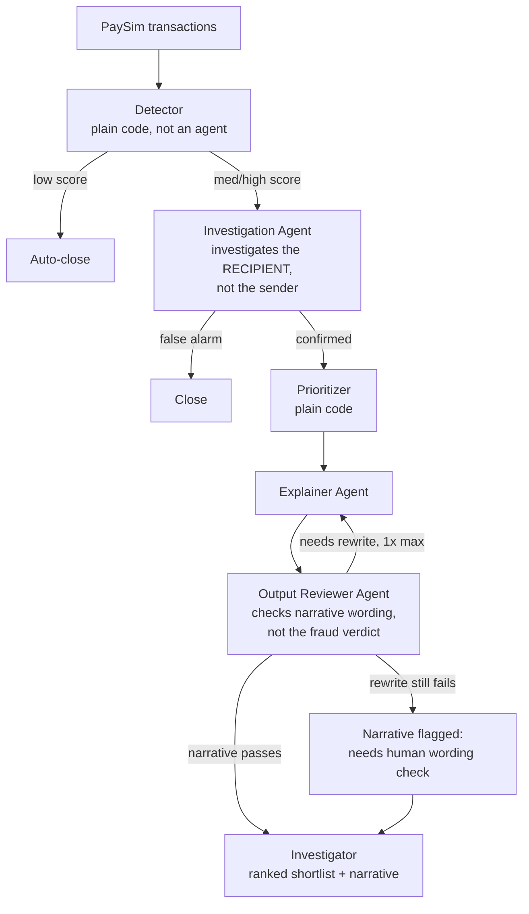

# Architecture

## Problem
A junior AML Investigations Analyst at a bank needs a fast, explainable way
to tell which flagged accounts show genuine money-mule behavior, because
90-95% of AML alerts are false positives requiring full manual review
(PricewaterhouseCoopers; peer-reviewed industry analysis, ScienceDirect 2024).

## About the Dataset
This system is built and evaluated on **PaySim**, a synthetic mobile-money
transaction dataset (Kaggle: ealaxi/paysim1). PaySim simulates one month
(744 hourly "steps") of transactions, generated from real transaction
patterns of a mobile money service operating in an African country, with
synthetic fraud injected for research use -- real financial data cannot
be shared publicly for privacy reasons, so this kind of simulation is
standard practice in fraud-detection research.

**Currency is deliberately unspecified.** PaySim's own documentation
states amounts are in "local currency" without naming which country or
currency. This is a genuine ambiguity in the source data, not an
oversight on our part -- our thresholds ($200,000, $500,000) are
expressed in the dataset's native units for internal comparison purposes
(matching PaySim's own built-in naive rule threshold), not as a literal
real-world dollar claim.

**Why only TRANSFER and CASH_OUT are treated as possible fraud.**
PaySim's documented fraud model is explicit: a fraudulent actor takes
control of a victim's account, TRANSFERS the funds to another account,
then CASH_OUTs to convert it to physical money and disappear. This is
not our assumption -- it is confirmed empirically: across the entire
6.3M-row dataset, zero fraud cases occur in PAYMENT, DEBIT, or CASH_IN
transactions. This is why `features.py` and `detector.py` treat
transaction type as a hard gate rather than a probabilistic signal --
excluding these three types costs zero recall, since fraud cannot occur
in them by the simulator's own design.

## Pipeline

Output Reviewer can send the narrative back to the Explainer for
ONE rewrite max, then flags for human review if still failing.

Note: "human review" here refers to checking the narrative's wording and
tone — the fraud verdict itself is decided earlier, by the Investigation
Agent, and is never re-opened by the Output Reviewer.

## Key data finding: investigate the recipient, not the sender
Analysis of PaySim showed money-mule accounts are defined by RECEIVING
from multiple already-flagged accounts (a "fan-in" pattern), not by
sending behavior. Measured: 58.5% of fraud-transfer recipients received
from 2+ flagged accounts, vs 0% connection rate on the sender side.
This is why the Investigation Agent's tools are called on nameDest
(recipient), not nameOrig (sender), of a flagged transaction.

Follow-up refinement: raw connection count was later found to be
confounded by transaction volume (a busy legitimate account naturally
accumulates high counts). The signal was corrected to fan_in_ratio
(% of incoming transactions from flagged senders), which proved more
reliable. A further finding showed fan_in_ratio is unreliable at very
low transaction volume (1-2 total transactions), where a ratio of 1.0
occurs by chance about as often on legitimate accounts as fraud ones.

## Data leakage fix
PaySim's own documentation states balance columns (oldbalanceOrg,
newbalanceOrig, oldbalanceDest, newbalanceDest) must not be used for
fraud detection, since cancelled fraud transactions leave an artificial
fingerprint in these fields. The Detector was corrected to use only
`type` and `amount`. Result: 100% recall (legitimate, since PaySim fraud
only ever occurs in TRANSFER/CASH_OUT types), confirmed on the FULL
6.3M-row dataset. At the real-world fraud base rate (~0.13%), honest
precision is 0.30% -- the earlier 14.97% figure was measured on an
artificially fraud-enriched sample and is not representative of
real-world performance.

Note: this Detector-level precision reflects component-level performance
in isolation. The 40%/53% figures below are the full pipeline's real,
held-out, end-to-end result -- the number that matters for the system
as a whole.

## Agents vs plain code
- Detector: plain code (threshold scoring on type + amount)
- Investigation Agent: REAL agent -- ReAct loop, 3 tools, up to 5 iterations
- Prioritizer: plain code (weighted ranking formula, not reasoning)
- Explainer Agent: REAL agent -- drafts hedged, evidence-based narrative
- Output Reviewer Agent: REAL agent -- checklist + safe-wording gate,
  1 rewrite max back to Explainer

Three genuine reasoning agents; two deterministic components. LLM calls
are used only where judgment is actually required.

## Investigation Agent's tools
- check_account_history: transaction count/pattern for this account,
  checked bidirectionally and only BEFORE the triggering transaction.
  Validated finding: legitimate accounts are actually MORE likely to
  have prior history than fraud accounts (73.5% vs 40%) -- a fresh
  account with no history is a signal TOWARD suspicion, not against it.
- check_linked_accounts: fan_in_ratio (% of incoming transactions from
  already-flagged senders) -- the strongest validated signal, though
  unreliable at very low transaction volume (see above).
- check_velocity: time between money in and out; often returns no data
  (None) given how PaySim generates account IDs -- expected, not a bug.

## Tech Stack
- Model: Claude Sonnet 4.5, via AWS Bedrock, used across all three real
  agents (Investigation, Explainer, Output Reviewer) and the verdict-
  structuring step. Detector and Prioritizer use no model -- both are
  plain code.
- Tools & model interface: LangChain (@tool decorator, ChatBedrock via
  langchain-aws)
- Orchestration: LangGraph (nodes, conditional edges, built on top of
  LangChain's pieces)
- Schema: Pydantic (typed state + verdicts)
- Evaluation: Custom evaluation harness (evaluate_detector.py,
  evaluate_pipeline.py, diagnose_pipeline.py) comparing predictions
  against ground-truth labels against real PaySim data.
- Guardrails: iteration cap (5), 1-rewrite cap, allowed_tools allow-list

## Final Evaluation Results
- 40% recall, 53% precision (Held-out Sample)
- Naive baseline comparison (isFlaggedFraud rule): 0.19% recall
- Real-world AML industry benchmark: 5-10% precision (see Benchmarking
  section below for sources)

Both results far exceed the naive baseline and sit well above real-world
industry precision benchmarks, evaluated on genuinely unseen data
specifically to test for overfitting to the tuning sample -- a
methodology deliberately chosen after finding, mid-development, that
performance on a heavily-tuned sample overstated real generalization.

## Benchmarking Against Real-World AML Systems

| | Recall | Precision |
|---|---|---|
| Naive baseline (PaySim's built-in isFlaggedFraud rule) | 0.19% | -- |
| Real-world AML systems (PwC; peer-reviewed industry analysis, ScienceDirect 2024) | -- | 5-10% |
| This system (held-out test data) | 40% | 53% |

The naive baseline figure is our own measured result, reproducible via
`evaluate_detector.py` (comparing PaySim's `isFlaggedFraud` field against
ground-truth `isFraud` labels). The real-world AML benchmark is drawn from
external sources -- PricewaterhouseCoopers reports 90-95% of transaction
monitoring alerts are false positives, consistent with peer-reviewed
industry research (ScienceDirect, 2024), corresponding to roughly 5-10%
precision.

This system achieves a ~200x improvement in recall over the naive
baseline, and a 5-10x improvement in precision over typical real-world
AML systems, evaluated on held-out data never used during development.